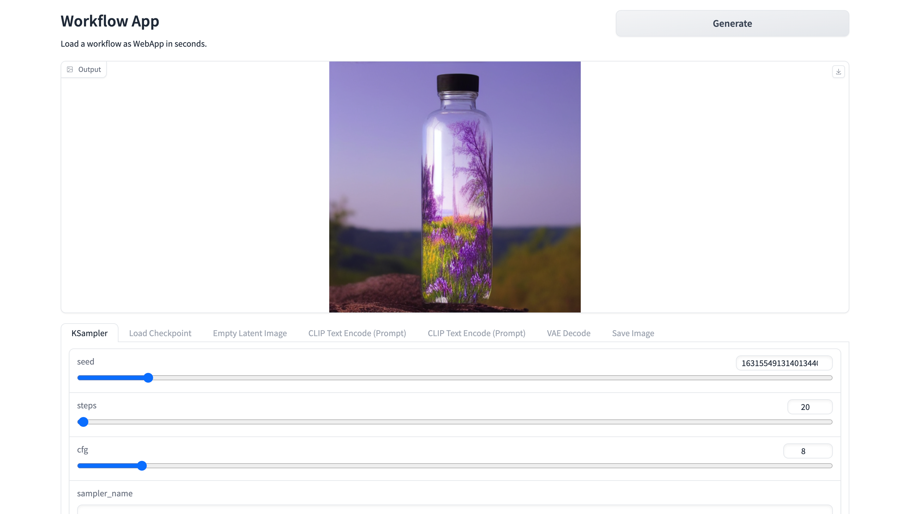

# ComfyFlowApp
Load Comfy workflow as Web App in seconds

## 简介
ComfyFlowApp 是ComfyUI的扩展工具，支持将ComfyUI的工作流转换为WebApp应用，方便分享给其他用户使用。

工作流开发者通过ComfyUI开发工作流，通过组合ComfyUI节点以及自定义扩展节点，ComfyUI工作流可以完成复杂的工作，如生成用户写真、电商产品换背景等，解决很多工作场景的实际需求。
但对普通用户来说，构建工作流复杂度高、需要花费大量精力，ComfyFlowApp简化了分享和使用工作流的方式，工作流开发者方便地分享给其他用户，其他用户不需要关心工作流内部细节，就可以使用工作流。
### 如何使用？

- 工作流开发, 在ComfyUI中开发工作流，参考[ComfyUI](https://github.com/comfyanonymous/ComfyUI)

- 上传工作流，将工作流生成的图片上传到ComfyFlowApp，并配置应用相关参数，生成WebApp应用

- 预览应用，在线预览WebApp应用

## 相关项目
- [ComfyUI](https://github.com/comfyanonymous/ComfyUI)

## 联系我们
ComfyWorkflowApp 项目还处于早期阶段，如果您有任何问题或建议，欢迎通过以下方式联系我们：

- [GitHub Issues](https://github.com/xingren23/ComfyWorkflowApp/issues)

- WeChat: 如果微信群二维码过期，请添加我的微信号：xingren23，备注“ComfyFlowApp”，我拉你进群。

 