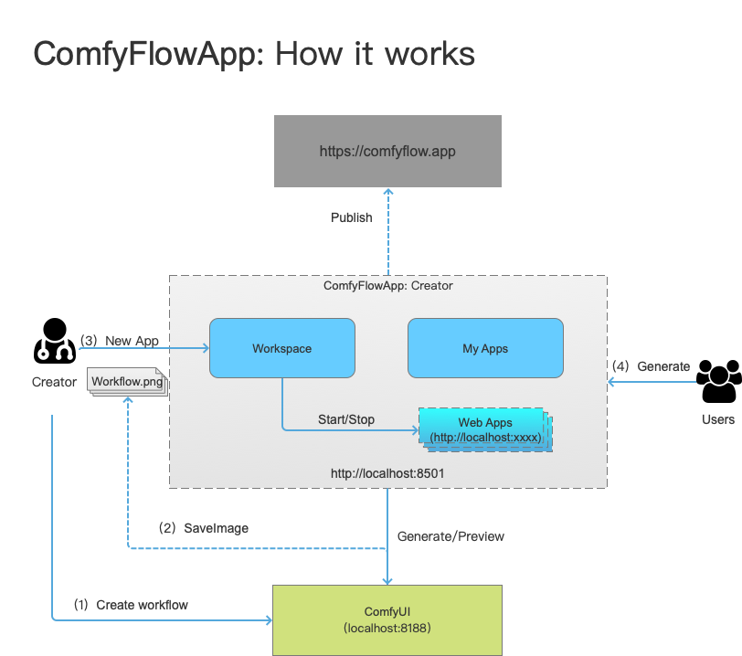

# 📌 Welcome to ComfyFlowApp

ComfyFlowApp is a tool to help you develop AI webapp from ComfyUI workflow and share to others.

English | [简体中文](./README_zh-CN.md)

## 📌 What is ComfyFlowApp?

ComfyFlowApp is an extension tool for ComfyUI, making it easy to create a user-friendly application from a ComfyUI workflow and lowering the barrier to using ComfyUI.

As shown in the images below, you can develop a web application from the workflow like "portrait retouching"


### Why You Need ComfyFlowApp?

If you want to generate an image using AI tools, you can choose MidJourney, DALL-E3, Fairfly (Adobe), or similar tools. These tools allow anyone to generate a beautiful image based on prompts. However, if you need more control over the generated results, like dressing a model in specific clothing, these tools may not suffice. Additionally, if your scenario has specific copyright requirements for images, you can use the open-source Stable Diffusion to build an AI image processing application. You have the choice of Stable-Diffusion-WebUI or ComfyUI, with WebUI being simple to use and having a rich plugin ecosystem for various processing needs. On the other hand, ComfyUI has a higher learning curve but offers more flexible workflow customization, allowing you to develop workflows for a wide range of scenarios.

If you need to share workflows developed in ComfyUI with other users, ComfyFlowApp can significantly lower the barrier for others to use your workflows:

- Users don't need to understand the principles of AI generation models.
- Users don't need to know the tuning parameters of various AI models.
- Users don't need to understand where to download models.
- Users don't need to know how to set up ComfyUI workflows.
- Users don't need to understand Python installation requirements.

ComfyFlowApp helps application developers make these complexities transparent to users, who can use it like any other regular application.

**In summary, if you want to share workflows developed in ComfyUI with other users, choosing ComfyFlowApp is the right choice.**

### How Does ComfyFlowApp Work?

ComfyFlowApp: Users (also creators) can develop a web application from the ComfyUI workflow in seconds, and share it with other users.

::: tip

[comfyflow.app](https://comfyflow.app/) is a platform for uploading and distributing ComfyUI web applications.

:::

The workflow is shown below:


### Typical Use Cases

1. Studio or Internal Business Collaboration

   In scenarios where a studio or internal business needs collaborative work division and not everyone needs to understand AI, various models, and workflow construction, a typical collaboration scenario involves one or a few developers building an AI application within ComfyUI, achieving satisfactory results, and saving the workflow. Then, developers use ComfyFlowApp's Creator tool to convert the workflow into a web application, hiding irrelevant fine-tuning parameters, making the application simple and easy to use. Developers can then share the application's address with other users within the studio or the company, who can access the deployed application through the shared address.

2. Professional Creators or Teams, Developing and Sharing Applications with a Wider Audience

   Professional creators or teams can use ComfyUI tools to develop valuable applications, but the usability of ComfyUI may be too high for the normal user. By using ComfyFlowApp to transform a workflow into an application suitable for a broader audience, developers can create more value. This process typically involves developers creating a workflow in ComfyUI, achieving satisfactory results, and saving the workflow. Developers then use ComfyFlowApp's Creator tool to convert the workflow into a web application, hiding irrelevant fine-tuning parameters, and making the application easy to use. After that, developers can publish the application in an app store, allowing other users to discover and download the application and run it locally.

**Follow the repo to get the latest updates.**

[](https://www.buymeacoffee.com/comfyflow)

### 📌 Quick Start

```bash
# download project
git clone https://github.com/xingren23/ComfyFlowApp

# create and activate python env
# Note: pytorch does not support python 3.12 yet so make sure your python version is 3.11 or earlier.
conda create -n comfyflowapp python=3.11
conda activate comfyflowapp

# install requirements
pip install -r requirements.txt

# start or run
# linux 
sh bin/creator_run.sh 
# windows
.\bin\creator_run.bat
```

env var, you could modify some env var as needed

```bash
:: log level default: INFO
set LOGURU_LEVEL=INFO

:: ComfyflowApp address，default: https://api.comfyflow.app
set COMFYFLOW_API_URL=https://api.comfyflow.app

:: comfyui env for developping，you could use other machine in the same LAN, default: http://localhost:8188
set COMFYUI_SERVER_ADDR=http://localhost:8188

:: webapp server address, others in the same LAN could visit your webapp, default: localhost
set STREAMLIT_SERVER_ADDRESS=192.168.1.100
```

### Videos

- [ComfyFlowApp install and develop first app](https://www.youtube.com/watch?v=glRO1q4IAI0&t=6s&ab_channel=ZhiguoWang)

### 📌 Related Projects

- [ComfyUI](https://github.com/comfyanonymous/ComfyUI)

### 📌 Contact Us

- [GitHub Issues](https://github.com/xingren23/ComfyWorkflowApp/issues)

- WeChat: if wegroup is expired, you could add xingren23，comment “ComfyFlowApp”，I will invite you to the group.

 
