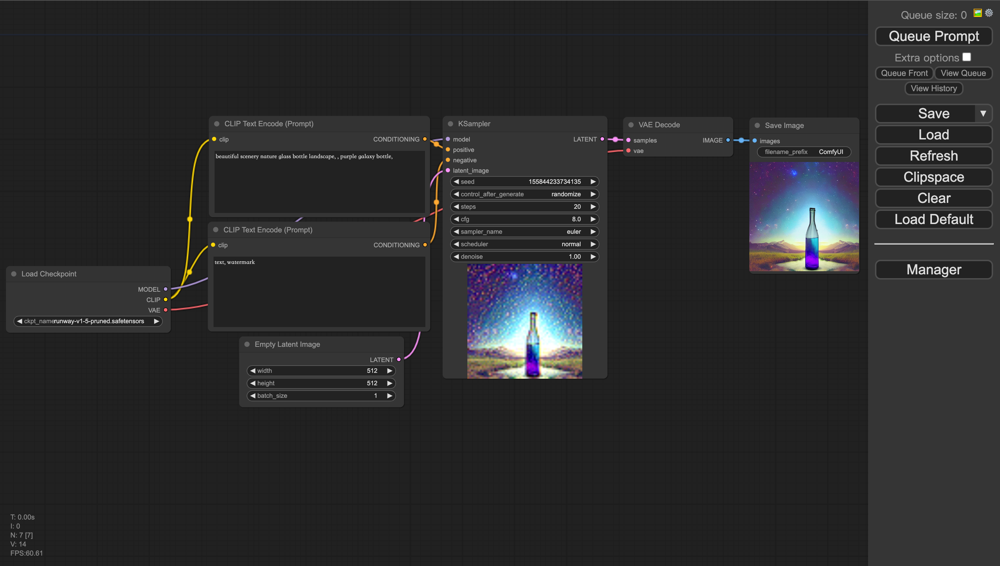
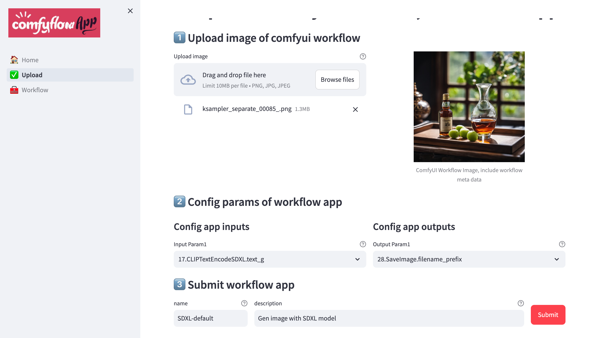
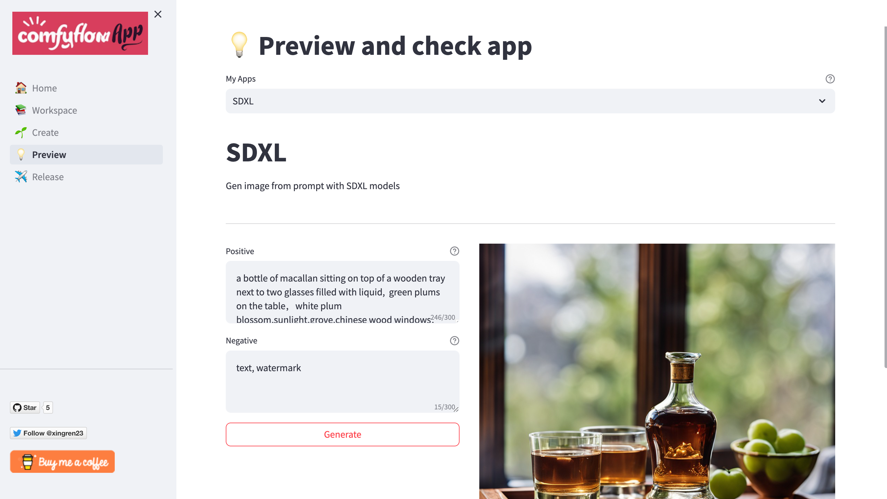
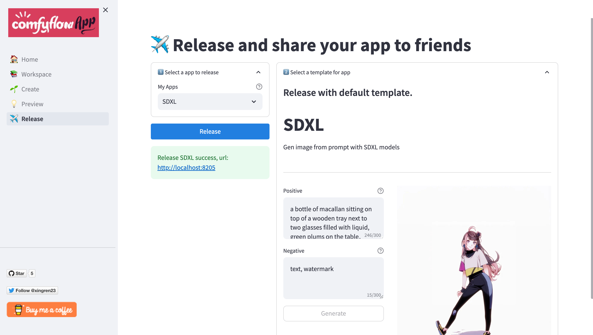
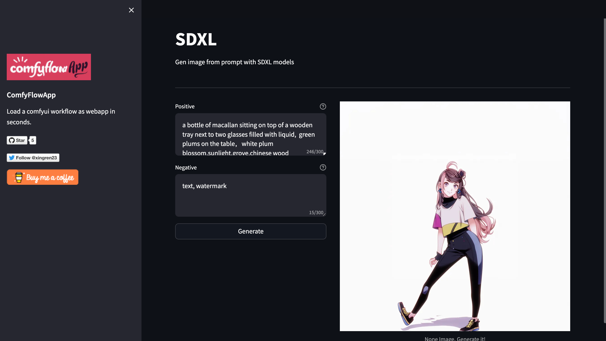

## 📌 Welcome to ComfyFlowApp

English | [简体中文](./README_zh-CN.md)

ComfyFlowApp is an extension tool for ComfyUI. It helps convert ComfyUI workflows into web applications, making it easy for sharing with other users.

Workflow developers create workflows using ComfyUI by combining ComfyUI nodes and custom extension nodes. ComfyUI workflows can perform complex tasks like generating user avatars or changing product backgrounds for e-commerce. This addresses many real-world work needs. However, for regular users, building workflows can be quite complicated and time-consuming. 
                        
ComfyFlowApp simplifies the way workflows are shared and used. Workflow developers can easily share their workflows as webapp with others, however users don't need to worry about the inner details of the workflow. They can simply use the webapp.


Follow the repo to get the latest updates.

[](https://www.buymeacoffee.com/comfyflow)

### 📌 Quick Start
- Linux & Mac
```bash
# install requirements
pip install -r requirements.txt

# configure environment variables, defaulut ComfyUI server address is 127.0.0.1:8188
export COMFYUI_SERVER_ADDR=127.0.0.1:8188

# start comfyflowapp
sh bin/start.sh
```


- Windows
```bash
# install requirements
pip install -r requirements.txt

# configure environment variables, defaulut ComfyUI server address is 127.0.0.1:8188
set COMFYUI_SERVER_ADDR=127.0.0.1:8188

# start comfyflowapp
./bin/run.bat
```

### 📌 How to develop a ComfyFlowApp?

1. Develop workflow in ComfyUI
2. Manage application in ComfyFlowApp Workspace, eg create & edit app, preview app, release app, and start & stop app, etc. 

    **when your application started, you could share app link to others.**

#### Detaiis

- Develop：develop workflow in ComfyUI, refer to [ComfyUI](https://github.com/comfyanonymous/ComfyUI)


- Workspace：manage application in Workspace, including create & edit app, preview app, release app, and start & stop app, etc.


    - (1)Create App：upload workflow image, configure app parameters, and generate webapp.


    - (2)Preview App：preview webapp, and check if the webapp is working properly.


    - (3)Release App：release webapp, and generate webapp link.


    - (4)Start & Stop App：start webapp, and access webapp link.

       
### 📌 Related Projects
- [ComfyUI](https://github.com/comfyanonymous/ComfyUI)

### 📌 Contact Us
- [GitHub Issues](https://github.com/xingren23/ComfyWorkflowApp/issues)

- WeChat: if wegroup is expired, you could add xingren23，comment “ComfyFlowApp”，I will invite you to the group.

 