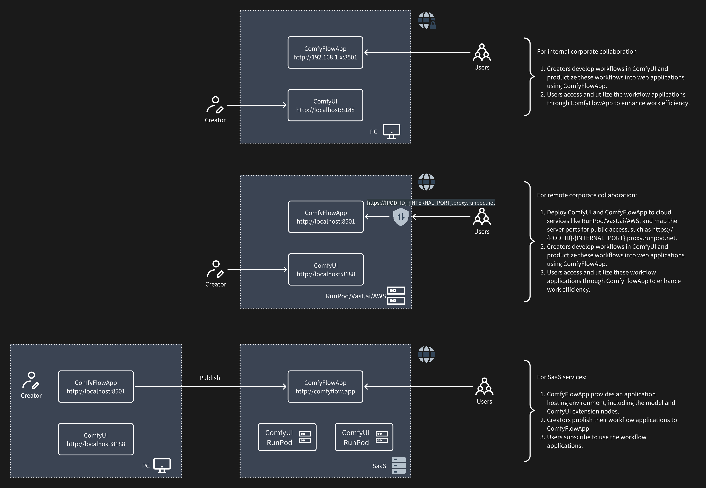

我们发布了ComfyFlowApp在线服务，创作者可以在线创建ComfyUI工作流应用，并分享给他人使用.
服务地址：[ComfyFlow](https://comfyflow.app)

# ComfyFlowApp

只要几秒就可以将你的ComfyUI工作流开发成一个Web应用，并分享给其他用户使用。

## ComfyFlowApp 是什么？

ComfyFlowApp 是一个 ComfyUI 的扩展工具， 可以轻松从 ComfyUI 工作流开发出一个简单易用的 Web 应用，降低 ComfyUI 的使用门槛。
如下图所示，将一个人像修复的工作流开发成一个 ComfyFlowApp 应用。


### ComfyFlowApp 有什么用？

如果你想通过 AI 工具来生成一张图片，可以选择的 MidJourney、DALL-E3、Fairfly（Adobe），使用这些工具任何人都可以通过提示词来生成一幅精美的图片，如果你想进一步控制生成的结果，如让模特穿上指定的衣服，这些工具可能都无法实现，或者你所在的场景对图片版权有特殊的要求，你可以使用开源的 Stable Diffusion 来构建 AI 图片处理应用，可以选择 Stable-Diffusion-WebUI 或者 ComfyUI，其中 WebUI 简单易用，插件生态丰富，可以满足很多场景的处理需求，而 ComfyUI 使用门槛较高，但支持更灵活的工作流定制，开发出满足各种场景需求的工作流。

如果你需要将 ComfyUI 中开发的工作流分享给其他用户使用，ComfyFlowApp 可以显著降低其他用户使用你的工作流的门槛。

- 用户不需要懂 AI 生成模型的原理；
- 用户不需要懂各种 AI 模型的调优参数；
- 用户不需要懂模型从哪里下载；
- 用户不需要懂如何搭建 ComfyUI 工作流；
- 用户不需要懂 Python 安装环境；

**总结，ComfyFlowApp 帮助工作流开发者简化工作流的使用难度，用户只需要像普通应用一样使用即可。**


### 使用场景



**1. 企业内部协作**

* 创作者在ComfyUI中开发工作流，并使用ComfyFlowApp将这些工作流产品化为Web应用。
* 使用者通过ComfyFlowApp使用这些工作流应用，以提高工作效率。

**2. 远程企业协作**

* 将ComfyUI和ComfyFlowApp部署到像RunPod/Vast.ai/AWS这样的云服务上，并将服务器端口映射为公网访问，例如https://{POD_ID}-{INTERNAL_PORT}.proxy.runpod.net。
* 创作者在ComfyUI中开发工作流，并使用ComfyFlowApp将这些工作流产品化为Web应用。
* 使用者通过ComfyFlowApp使用这些工作流应用，以提高工作效率。

关注本项目，获取最新动态。

### 快速开始

ComfyFlowApp 提供了一个测试账号：demo 密码：comfyflowapp，为了更好的用户体验，你可以在 https://comfyflow.app 注册自己的账号。

```bash
# 下载项目
git clone https://github.com/xingren23/ComfyFlowApp

# 使用Conda创建并管理python环境
conda create -n comfyflowapp python=3.11
conda activate comfyflowapp

# 安装ComfyFlowApp依赖
pip install -r requirements.txt

# 启动
# linux
sh bin/creator_run.sh
# windows
.\bin\creator_run.bat

```
Windows用户可以直接下载一键包：[comfyflowapp-python-3.11-amd64.7z](https://github.com/xingren23/ComfyFlowApp/releases)


环境变量, 在启动脚本中可以修改相关变量

```
:: ComfyflowApp 地址，默认：https://api.comfyflow.app
set COMFYFLOW_API_URL=https://api.comfyflow.app

:: 开发联调外部ComfyUI地址，可以连接局域网内其他服务器地址，默认：http://localhost:8188
set COMFYUI_SERVER_ADDR=http://localhost:8188

:: 设置web应用启动地址，让局域网内其他用户可以访问你的应用，默认：localhost
set STREAMLIT_SERVER_ADDRESS=192.168.1.100
```


## 相关项目

- [ComfyUI](https://github.com/comfyanonymous/ComfyUI)

## 联系我们

ComfyWorkflowApp 项目还处于早期阶段，如果您有任何问题或建议，欢迎通过以下方式联系我们：

- [GitHub Issues](https://github.com/xingren23/ComfyWorkflowApp/issues)

- [ComfyFlowApp Discord](https://discord.gg/rjbdD3EkYw)
